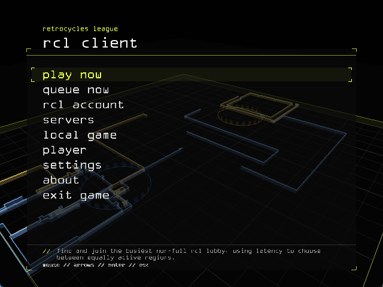

# retrocycles rcl client

The [Retrocycles League](https://retrocyclesleague.com) build of Armagetron
Advanced: a lightcycle game where you box in the other team with your wall and
take their zone. This repository holds the player client and the RCL dedicated
server. Both stay protocol-compatible with the **sty+ct+ap** servers the league
already runs, so an RCL client can join any of them and stock clients can join
RCL servers.

Current release line: `0.2.9+sty+ct+ap+rcl`.



## what the client adds

- **Play Now**: pick Fort, Sumobar or TST and the client joins a live,
  non-full RCL lobby in the nearest region.
- **Queue Now**: the same choice, then it adds you to the pickup queue once the
  server has verified your account.
- **RCL sign-in**: sign in once with your RCL game username and password. Your
  tier, rank and Elo show on the main menu. Guest play still works.
- **One menu style**: every menu uses the same panel layout, in the league's
  colours.
- **A match behind the menus**: a league Fortress match replays in the
  background, names removed, opening from overhead and then swooping through
  the fight.
- **A server browser that does not freeze** after a disconnect.

The design and its trust boundaries are in
[docs/CLIENT_ARCHITECTURE.md](docs/CLIENT_ARCHITECTURE.md).

## get it

The client is in team beta. Steam
[Retrocycles](https://store.steampowered.com/app/1306180/Retrocycles/) is still
the public default and installs side by side with this build.

Beta packages are built by the `build-client` workflow for every commit on
`main`:

| Platform | Package | Run |
|----------|---------|-----|
| Windows x86-64 | `Retrocycles-RCL-{version}-windows-x86_64.zip` | extract, double-click `Retrocycles-RCL.cmd` |
| macOS Apple Silicon | `Retrocycles-RCL-{version}-macos-arm64.zip` | open `Retrocycles RCL.app` |
| Linux x86-64 | `Retrocycles-RCL-{version}-linux-x86_64.tar.gz` | `./retrocycles-rcl` |

Download them from the latest run under
[Actions](https://github.com/retrocyclesleague/armagetronad-rcl/actions/workflows/build-client.yml)
(GitHub sign-in required), or from a tagged
[release](https://github.com/retrocyclesleague/armagetronad-rcl/releases) once
one is published. The beta checklist and release process are in
[docs/CLIENT_BETA.md](docs/CLIENT_BETA.md).

## build it

```bash
# Windows, from an MSYS2 MINGW64 shell
bash scripts/build-windows-client.sh

# Linux
bash scripts/build-linux-client.sh

# macOS
bash build-macos.sh
```

Each script prints the path of the client binary. They build optimised
binaries; set `RCL_DEBUGLEVEL=3 RCL_CODELEVEL=2` before the first run for a
debug build with warnings. The package list each platform needs is in
[.github/workflows/build-client.yml](.github/workflows/build-client.yml).

For the dedicated server, the RCL server commands and the agent setup, see
[README-RCL.md](README-RCL.md) and [AGENTS.md](AGENTS.md). The upstream engine
guide is [README-DEVELOPER](README-DEVELOPER).

## report a bug

Open an [issue](https://github.com/retrocyclesleague/armagetronad-rcl/issues)
or post in the league [Discord](https://discord.gg/retrocycles). Include the
version from the About screen, your OS, and the steps that trigger it.

## licence

GPL-2.0-or-later, the same as Armagetron Advanced; see
[COPYING.txt](COPYING.txt). Third-party components are listed in
[THIRD_PARTY_NOTICES.md](THIRD_PARTY_NOTICES.md). Armagetron Advanced is the
work of its [authors](AUTHORS); this fork adds the league's client and server
changes on top.
